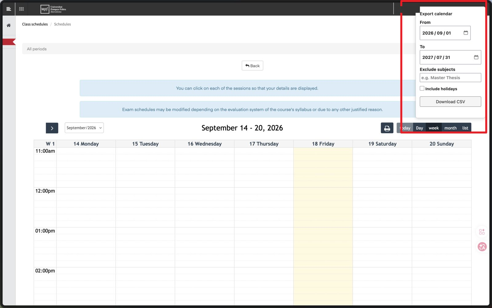

# UPF Calendar Exporter

A userscript that exports your UPF timetable to a calendar file you can import into Apple Calendar, Google Calendar, or Outlook.

No login details, no cookies to copy, no command line. Open your timetable, pick a date range, click a button.



## Why

UPF's timetable lives behind Secretaria Virtual and has no export button. Copying a whole year of classes by hand is tedious, and the schedule changes often enough that you end up doing it more than once.

This script reads the same data the timetable page already loads and turns it into a standard calendar CSV.

## Install

1. Install a userscript manager:
   - [Tampermonkey](https://www.tampermonkey.net/) — Chrome, Edge, Safari, Firefox
   - [Violentmonkey](https://violentmonkey.github.io/) — open-source alternative
2. Open [`upf-calendar-exporter.user.js`](upf-calendar-exporter.user.js), click **Raw**, and confirm the install prompt.

## Usage

1. Log in to [Campus Global](https://www.upf.edu/intranet/campus-global/).
2. Go to **Els meus horaris** → **Veure Calendari**, and wait for your timetable to appear.
3. An **Export calendar** panel appears in the top-right corner. Set:

   | Field | Meaning |
   |---|---|
   | From / To | Date range to export. Defaults to the current academic year (1 Sep – 31 Jul). |
   | Exclude subjects | Comma-separated text. Any class whose name contains one of these is skipped — useful for `Master Thesis` and other placeholder entries. Case-insensitive. |
   | Include holidays | Off by default. UPF returns holidays and non-teaching days as fake 11:00–19:00 events, which clutter your calendar. |

4. Click **.ics** or **.csv**. The panel reports how many events were exported, and the file lands in your downloads folder.

**Which format?** Use **.ics** for Apple Calendar or any app that subscribes to standard calendar files — it carries the Europe/Madrid timezone, so the times stay correct if you travel. Use **.csv** for Google Calendar's importer. Both contain the same classes.

## Importing the file

**Import into a new, empty calendar rather than your main one.** Timetables change, and a separate calendar means you can recolor every class at once, hide them during holidays, or delete the whole set and re-import instead of hunting down events one by one.

### Google Calendar (.csv)

Import must be done on the web — the mobile apps cannot import files.

1. Create the destination calendar: open [Google Calendar](https://calendar.google.com/), then **Settings ⚙ → Settings → Add calendar → Create new calendar**. Name it something like `UPF classes` and click **Create**.
2. Go to [Settings → Import & export](https://calendar.google.com/calendar/r/settings/export).
3. Under **Import**, click **Select file from your computer** and choose `upf_calendar.csv`.
4. In **Add to calendar**, pick the calendar you just created — this dropdown defaults to your personal calendar, so change it here.
5. Click **Import**. Google confirms with "X events imported".

Once imported, the classes sync to Google Calendar on your phone automatically. To change the colour, hover the calendar name in the left sidebar → **⋮ → pick a colour**.

To remove them later, go to **Settings → the calendar's name → Remove calendar**. That deletes all imported classes at once.

Google also accepts the `.ics` file through the same importer, if you prefer.

### Apple Calendar (.ics)

Apple Calendar does not read CSV, so use the **.ics** file here. Importing is done on a Mac — iOS has no file import — and once the events are in an iCloud calendar they appear on your iPhone and iPad automatically.

1. Open **Calendar** on your Mac.
2. Create the destination calendar: **File → New Calendar → iCloud**, and name it `UPF classes`. Choosing iCloud rather than "On My Mac" is what makes it sync to your other devices.
3. Choose **File → Import**, select `upf_calendar.ics`, and click **Import**.
4. When asked which calendar to add the events to, pick `UPF classes`.

If you only want the classes on that Mac, create the calendar under **On My Mac** in step 2 instead.

No Mac? Import the `.ics` into [Google Calendar](https://calendar.google.com/calendar/r/settings/export) instead, then add that Google account to your iPhone under **Settings → Calendar → Accounts**.

### Outlook (.csv or .ics)

1. Go to [Outlook on the web](https://outlook.office.com/calendar/) — the desktop app's import is less reliable.
2. In the left sidebar, click **Add calendar → Create blank calendar**, name it `UPF classes`, and save.
3. Click **Add calendar → Upload from file**, choose either file, select `UPF classes` as the destination, and click **Import**.

### After importing

Spot-check a couple of classes against the timetable page — especially the first week and a week after the winter break — to confirm the times and rooms line up. If the timetable changes mid-year, delete the calendar and re-import rather than editing events by hand.

## What you get

One event per class, with:

- **Title** — subject name and session type, e.g. `Machine Learning for Sound and Music [Theory]`
- **Location** — room number, e.g. `52.329`
- **Description** — group, teachers, and subject code
- **.ics** — events pinned to the Europe/Madrid timezone
- **.csv** — UTF-8 with BOM, so accented subject names survive Excel

## Troubleshooting

**"Session expired. Reload the page and try again."**
Secretaria Virtual sessions are short. Reload the timetable page, let it render, then export again.

**"No events in that range."**
Check the date range. UPF only has data for academic years you were enrolled in, and the range must start before it ends.

**The panel never appears.**
It only runs on the timetable page itself (`secretariavirtual.upf.edu/pds/control/PubliHoraAlumCalendario`). If you are on a different page, navigate to your timetable. Otherwise check the script is enabled in your userscript manager.

**Some classes are missing.**
The script exports exactly what the timetable page shows. If a subject is missing there too, it is not yet published in Secretaria Virtual.

## How it works

The timetable page fetches its events from an internal endpoint:

```
POST /pds/control/[Ajax]selecionarRangoHorarios?start=<epoch>&end=<epoch>
```

The script calls that same endpoint from the page, so your existing session authenticates the request — nothing is sent anywhere else. The response is filtered and written out in [Google Calendar's CSV format](https://support.google.com/calendar/answer/37118).

## Notes

This is not affiliated with or endorsed by UPF. It depends on an internal endpoint that UPF may change without notice; if exports suddenly stop working, please open an issue.

Originally a fix for [miquelvir/upf-calendar-exporter](https://github.com/miquelvir/upf-calendar-exporter), whose endpoint moved from `gestioacademica.upf.edu` to `secretariavirtual.upf.edu`. Rewritten as a userscript so no Python or cookie handling is needed.

## License

MIT
